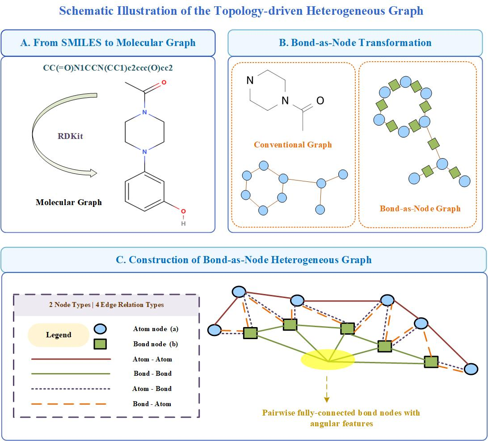

# NED-HGT: A Node-Edge Decoupled Heterogeneous Graph Transformer for Accurate Solubility Prediction

Source code for the paper "NED-HGT: A Node-Edge Decoupled Heterogeneous Graph Transformer for Accurate Solubility Prediction".

We propose a message-passing-based heterogeneous graph neural network to predict the solubility properties of drug molecules. With a carefully designed multi-view heterogeneous graph, this model can learn more chemical information and structural information from molecules.



## Dataset

The data used in this paper (esol/lipo/freesolv) are publicly available on [MoleculeNet](http://moleculenet.org/datasets-1).

AqSolDB and CASR-1 datasets are also included in the data directory.

## Environment

### Requirements

- PyTorch >= 1.8.0
- DGL >= 0.7.0
- RDKit >= 2020.09.1
- scikit-learn
- pandas
- numpy
- tensorboard

## Usage

### Quick Run (Scaffold-aware Split)

For ESOL:
```bash
python train.py configs_new/scaffold/esol_scaffold.json
```

For FreeSolv:
```bash
python train.py configs_new/scaffold/freesolv_scaffold.json
```

For Lipophilicity:
```bash
python train.py configs_new/scaffold/lipo_scaffold.json
```

For AqSolDB:
```bash
python train.py configs_new/scaffold/AqSolDB_scaffold.json
```

For CASR-1:
```bash
python train.py configs_new/scaffold/casr-1_scaffold.json
```

## Configuration

### Data Split Seeds

The configuration files use `seed` field to specify data split seeds (default: `[2022, 2023, 2024, 2025, 2026]`). These seeds control how molecules are partitioned into train/valid/test sets.

### Training Seed

The training seed is hardcoded in the training scripts (`train_seed = 400`). To change the training seed, modify the corresponding line in:
- `train.py`

Values `0`, `100`, `200`, `300`, `400` are merely examples — any integer seed you want is acceptable.

## Data Preparation

### Generate Scaffold Splits

To generate scaffold-aware splits for a new dataset:
```bash
python data/scaffold.py --input data/your_dataset.csv --output data/your_dataset/scaffold_split --seed 2022 2023 2024 2025 2026
```

